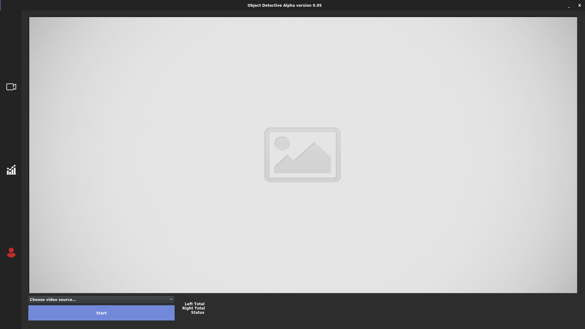
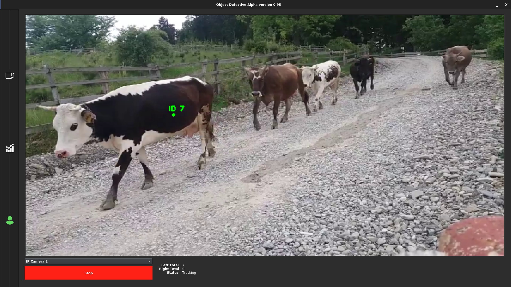
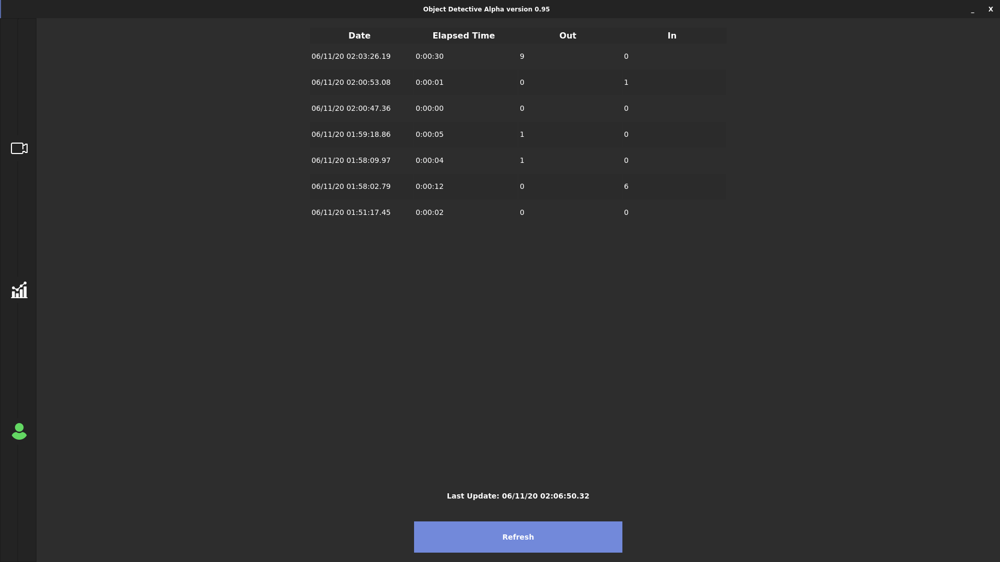
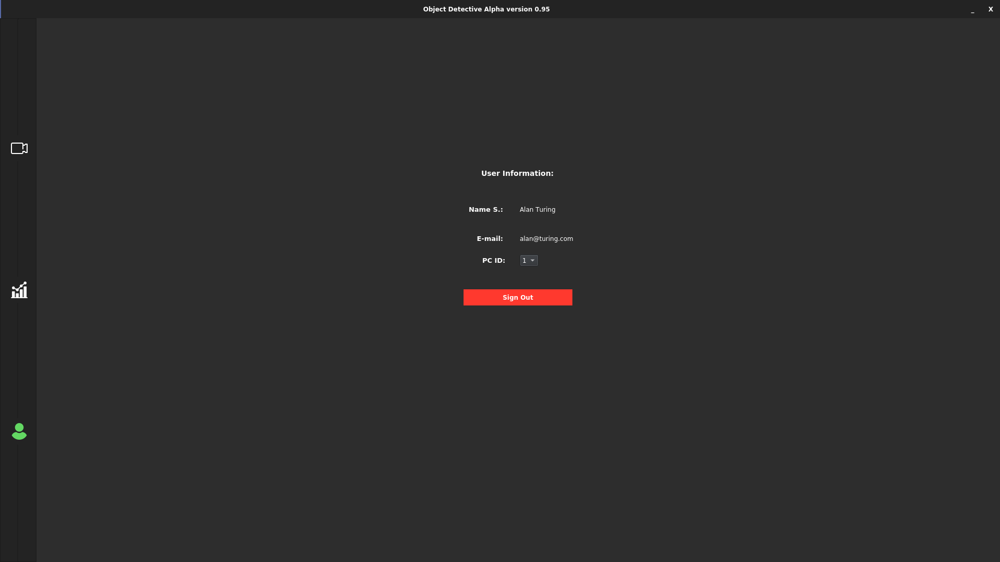
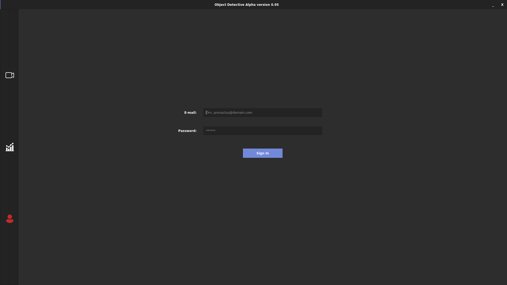

# Object Detective: A Desktop App
* Current version: Alpha 0.95
* **Note:** Application is currently in Turkish language. There'll be English version in final.
For Turkish documentation [click here](./tr_documentation.md)!
### About
- **Goal**: Detect track and count the object according to its horizontal direction. 
- Object Detective is an **open-source** cross-platform desktop application written in Python. It uses MySQL server to store its data and it requires an *login system*. 
- You can use this code for your own purposes however **if you need technical support, please consult us. You can reach out via email or LinkedIn for the right price and customized version for your purpose of our app.**
- Currently our app supports for one-class object detection (which is *cows* right now) however anyone who is eligible enough, can train their own **TensorFlow** model and use this algorithm with it.

### Team
- [Fatih Yaman](https://www.linkedin.com/in/fatih-yaman/)
- Mertcan Arat
- [Ahmet Faruk Akgün](https://www.linkedin.com/in/ahmet-faruk-akg%C3%BCn-8b77a1159/)
### How To Run? 
Suggested Python version is 3.6 or higher. 

1. Create a MySQL server from file named *detectionDB_v1.sql* and configure your *sign_in/db_connection* file according to your server.
2. Install requirements.
3. Make sure cmake and dlib is installed.
4. cd ./app (Go to the file named *app*)
5. Run **program.py**!
* For **Windows: python program.py**
* For **Linux: sudo python3 program.py** (Tested on Ubuntu 20.04)
-- *Not tested on MacOS*

### Special thanks to: 
- [pyimagesearch.com](https://www.pyimagesearch.com/2018/08/13/opencv-people-counter/) for sharing the tracking algorithm for free thus we customized for TensorFlow models.
- [Wanderson Magalhaes](https://github.com/Wanderson-Magalhaes/Simple_PySide_Base) for amazing GUI design and ideas.
 
## Photos
- Main window (Not signed in - Watch out profile icon at left bottom-):

- Active main window (signed in):

- Logs: 

- Signed in user window (*PC ID* attribute is a placeholder right now. Still working on it.) :

- Sign in window: 

**Final notes:** Soon my colleagues will be sharing the cow dataset that we pictured and organized for training the model.