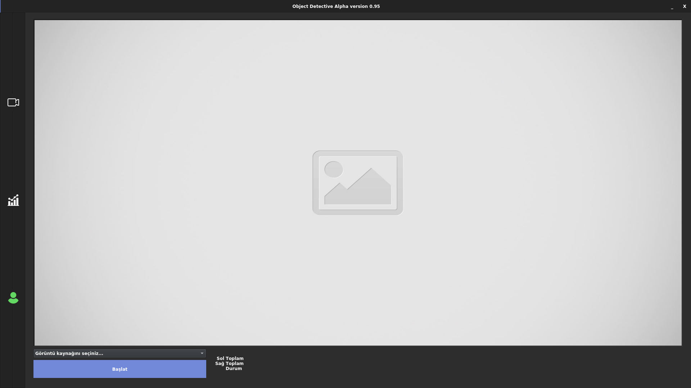
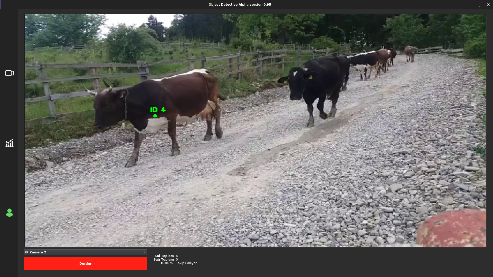
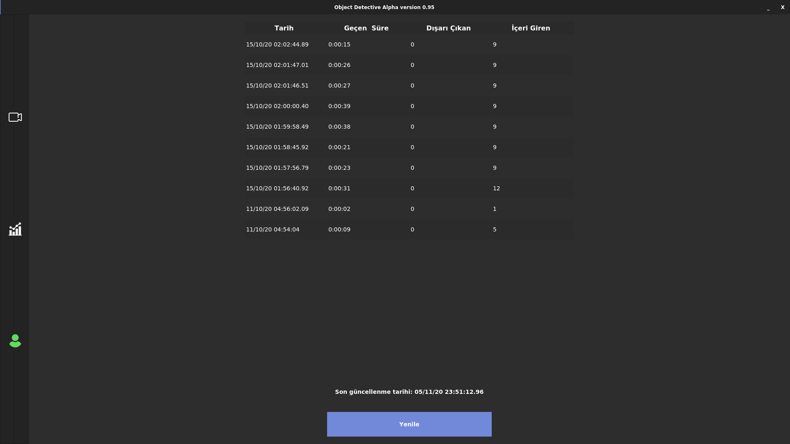
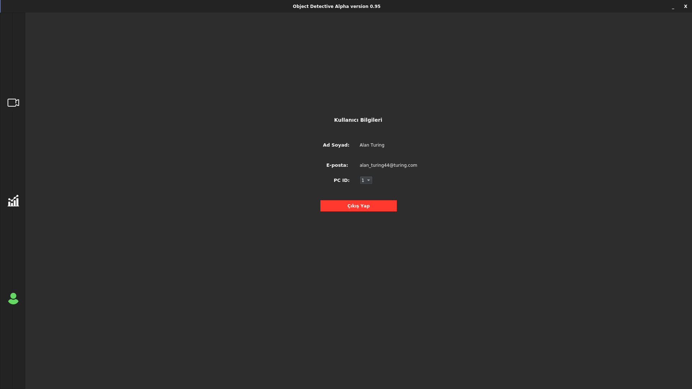
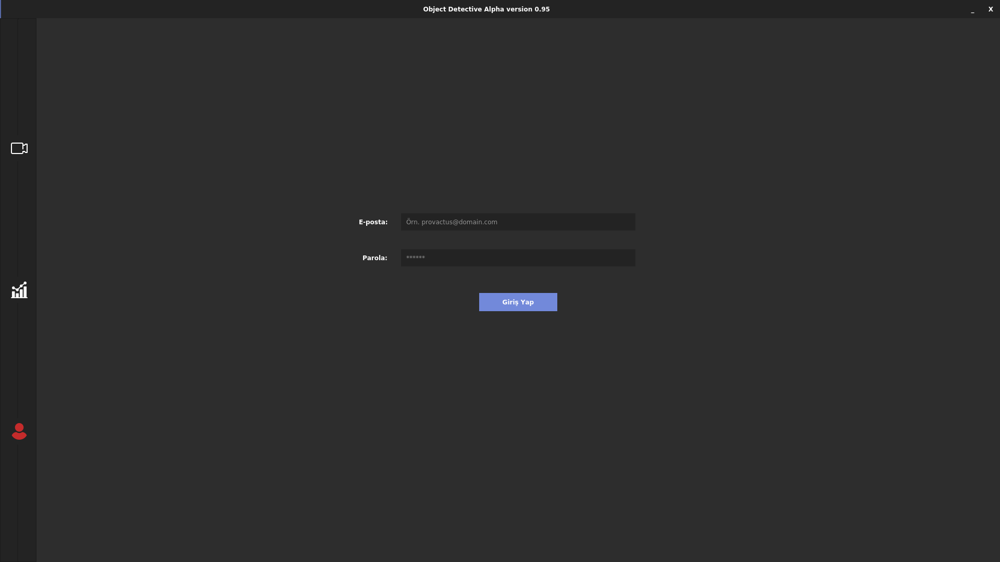

# Object Detective: Masaüstü Uygulaması (Henüz tamamlanmayan döküman)
* Güncel versiyon: Alpha 0.95
### Hakkında
- **Amaç**: Objeleri algılayıp, takip etmek ve yatay düzleme göre saymak.
- Object Detective, Python'da yazılmış, **açık kaynak kodlu** ve çapraz-platformlu bir masaüstü uygulamasıdır. Verileri depolamak için bir MySQL sunucuya ve bir kullanıcı giriş sistemine ihtiyaç duyar.
- Bu kodu kendi amaçlarınız için kullanıp, değiştirebilirsiniz fakat **teknik desteğe ihtiyaç duyarsanız bize danışabilirsiniz. E-posta veya LinkedIn üzerinden bize ulaşabilir ve uygulamamızın, amacınız için özelleştirilmiş bir versiyonunu, doğru fiyata alabilirsiniz.** 
- Şuan uygulamamız tek sınıfı algılayabilmekte (O sınıf ise şimdilik *inekler*) fakat yeterli bilgiye ve donanıma sahip olan herhangi bir yazılımcı, kendine ait **TensorFlow** modelini eğitebilir ve kullanabilir.

### Ekip
- [Fatih Yaman](https://www.linkedin.com/in/fatih-yaman/)
- Mertcan Arat
- [Ahmet Faruk Akgün](https://www.linkedin.com/in/ahmet-faruk-akg%C3%BCn-8b77a1159/)

### Nasıl çalıştırılır? 
Önerilen Python versiyonu 3.6 veya daha üstüdür.

1. Create a MySQL server from file named *detectionDB_v1.sql* and configure your *sign_in/db_connection* file according to your server.
2. Install requirements.
3. Make sure cmake and dlib is installed.
4. cd ./app (Go to the file named *app*)
5. Run **program.py**!
* For **Windows: python program.py**
* For **Linux: sudo python3 program.py** (Tested on Ubuntu 20.04)
-- *Not tested on MacOS*

### Special thanks to: 
- [pyimagesearch.com](https://www.pyimagesearch.com/2018/08/13/opencv-people-counter/) for sharing the tracking algorithm for free thus we customized for TensorFlow models.
- [Wanderson Magalhaes](https://github.com/Wanderson-Magalhaes/Simple_PySide_Base) for amazing GUI design and ideas.
 
## Photos
- Main window (Not signed in - Watch out profile icon at left bottom-):

- Active main window (signed in):

- Logs: 

- Signed in user window (*PC ID* attribute is a placeholder right now. Still working on it.) :

- Sign in window: 

**Final notes:** Soon my colleagues will be sharing the cow dataset that we pictured and organized for training the model.